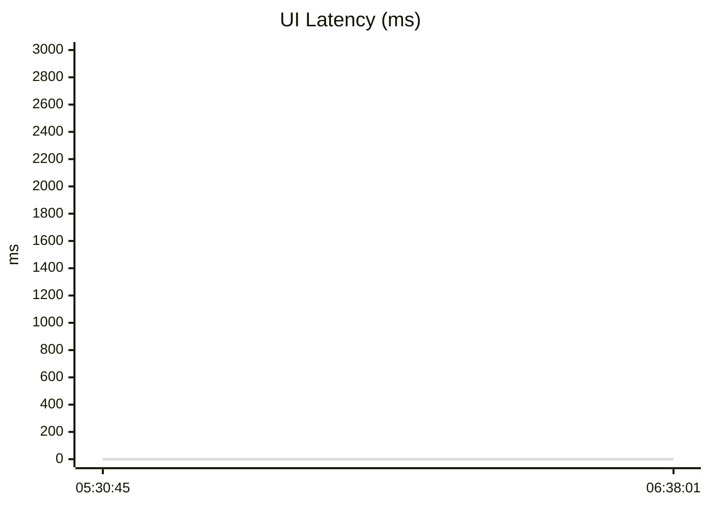

# UI 延迟监控（最近 2 次）

- 单位：毫秒（ms）
- `-1` 表示超时或异常

## 最近一次检测

| URL | 延迟 |
|---|---|
| jz.***.uy | ❌ |
| jz.***.io | ❌ |
| greenwave1987.***.in | ❌ |
| jz.***.xyz | ❌ |

## 延迟曲线

```mermaid
xychart-beta
  title "UI Latency (ms)"
  x-axis ["05:30:45", "06:38:01"]
  y-axis "ms" 0 --> 3000
  line "jz.***.uy" [-1, -1]
  line "jz.***.io" [-1, -1]
  line "greenwave1987.***.in" [-1, -1]
  line "jz.***.xyz" [-1, -1]
```
