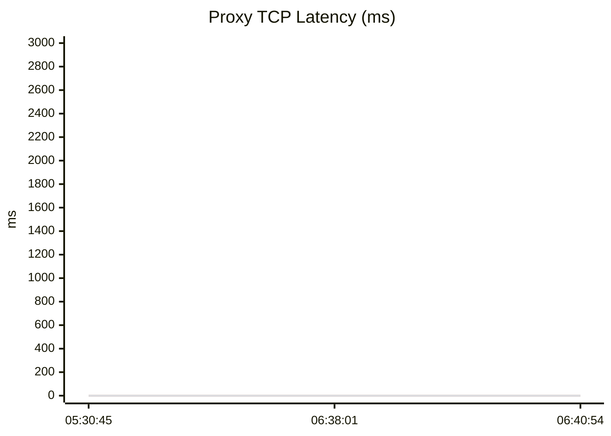

# 代理 TCP 延迟监控（最近 3 次）

- 测量：TCP connect 延迟
- 单位：ms
- -1 表示连接失败或超时

## 最近一次检测

| 代理 | 延迟 |
|---|---|
| http://jz.***.uy:19873 | ❌ |
| http://jz.***.io:19873 | ❌ |
| http://greenwave1987.***.in:19873 | ❌ |
| http://jz.***.xyz:19873 | ❌ |

## 延迟曲线

