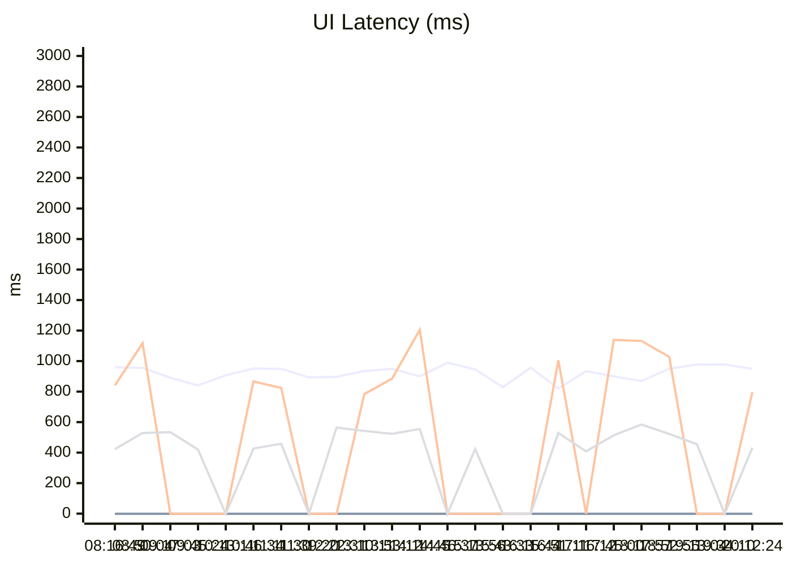

# UI 延迟监控（最近 24 次）

> -1 表示超时或异常

## 最近一次检测

| URL | 延迟 (ms) |
|---|---|
| http://jz.***.uy | 949 |
| http://jz.***.io | ❌ |
| http://greenwave1987.***.in | 796 |
| http://jz.***.xyz | 432 |

## 延迟曲线

